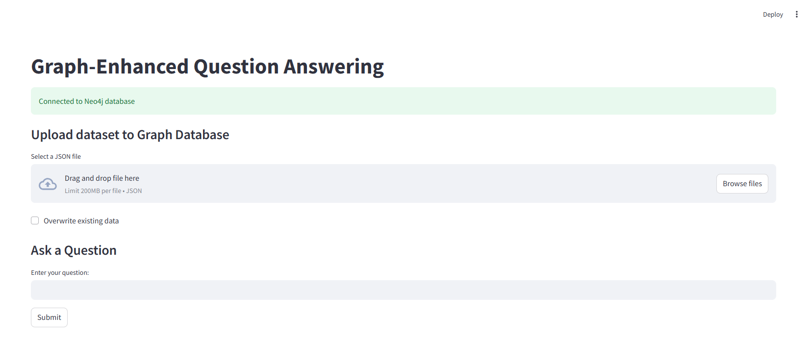

# Graph-Enhanced-QA
"Graph-Enhanced Question Answering
Setup Guide
Follow these steps to set up and run the Graph-Enhanced-QA application:
Prerequisites
Python 3.7+
Neo4j database
OpenAI API key

Installation
1) Clone the repository:
        git clone <repository-url>
        cd <repository-directory>
2) Create a virtual environment:
        python -m venv venv
        source venv/bin/activate  # On Windows, use `venv\Scripts\activate`

3) Install required packages:
        pip install requirement.txt
4) Configuration
        Create a .env file in the project root directory with the following content:
        Ensure you have a Neo4j database set up and running.
5) Running the Application
    Start the Streamlit app:
    streamlit run app.py

6) Open your web browser and navigate to the URL provided by Streamlit (usually http://localhost:8501).

